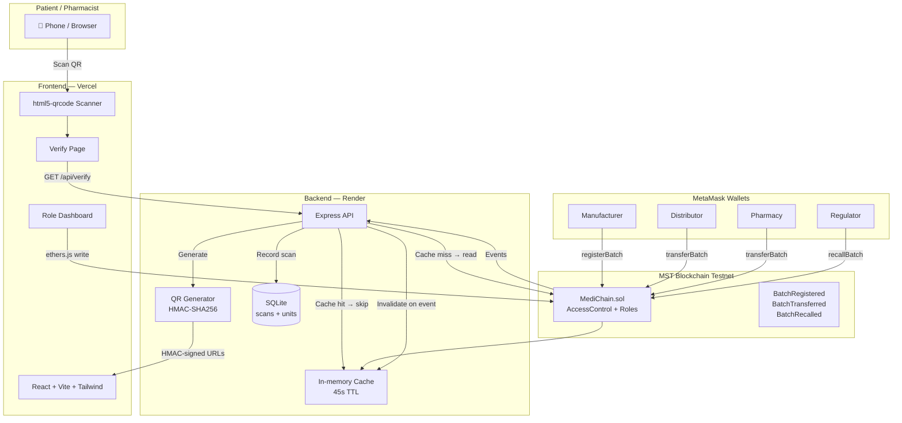
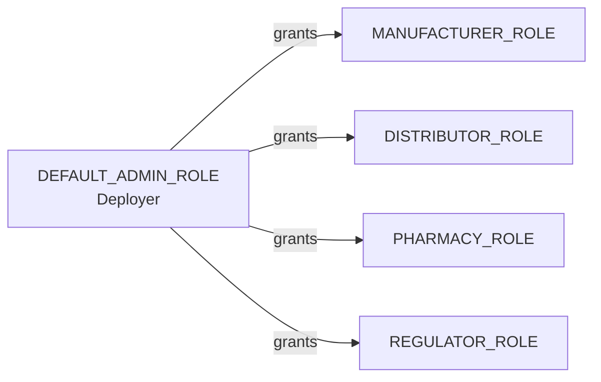
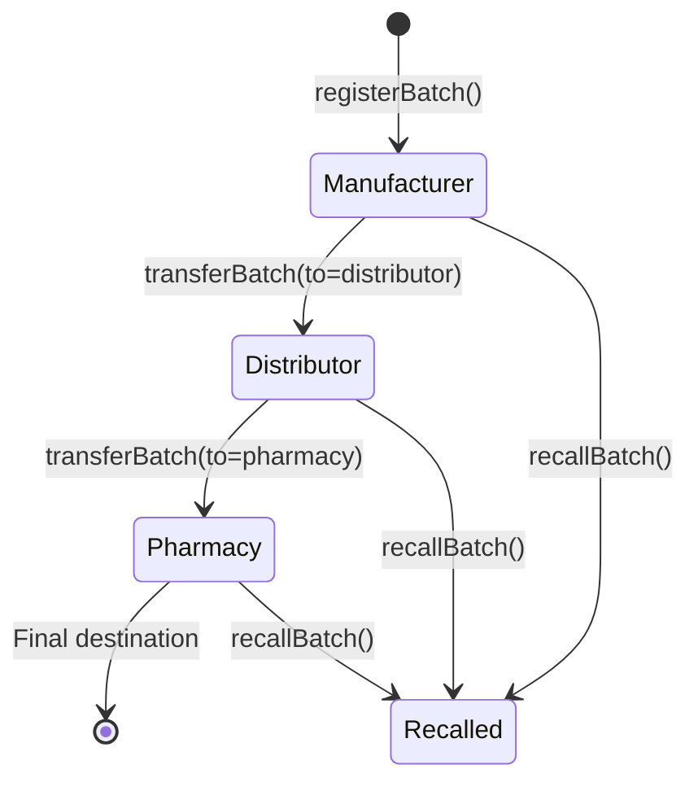
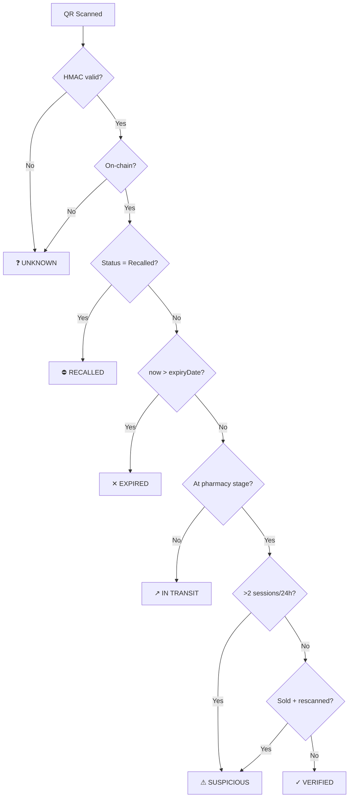

# MediChain Architecture

## System Architecture

```mermaid
graph TB
    subgraph "Patient / Pharmacist"
        Phone[📱 Phone / Browser]
    end

    subgraph "Frontend — Vercel"
        FE[React + Vite + Tailwind]
        Scanner[html5-qrcode Scanner]
        Dashboard[Role Dashboard]
        Verify[Verify Page]
    end

    subgraph "Backend — Render"
        API[Express API]
        Cache[In-memory Cache<br/>45s TTL]
        QRGen[QR Generator<br/>HMAC-SHA256]
        DB[(SQLite<br/>scans + units)]
    end

    subgraph "MST Blockchain Testnet"
        SC[MediChain.sol<br/>AccessControl + Roles]
        Events[BatchRegistered<br/>BatchTransferred<br/>BatchRecalled]
    end

    subgraph "MetaMask Wallets"
        Mfg[Manufacturer]
        Dist[Distributor]
        Phar[Pharmacy]
        Reg[Regulator]
    end

    Phone -->|Scan QR| Scanner
    Scanner --> Verify
    Verify -->|GET /api/verify| API
    API -->|Cache hit → skip| Cache
    API -->|Cache miss → read| SC
    SC --> Cache
    API -->|Record scan| DB
    API -->|Invalidate on event| Cache
    SC -->|Events| API

    Dashboard -->|ethers.js write| SC
    Mfg -->|registerBatch| SC
    Dist -->|transferBatch| SC
    Phar -->|transferBatch| SC
    Reg -->|recallBatch| SC

    API -->|Generate| QRGen
    QRGen -->|HMAC-signed URLs| FE
```

## Smart Contract Roles

```mermaid
graph LR
    Admin[DEFAULT_ADMIN_ROLE<br/>Deployer] -->|grants| MR[MANUFACTURER_ROLE]
    Admin -->|grants| DR[DISTRIBUTOR_ROLE]
    Admin -->|grants| PR[PHARMACY_ROLE]
    Admin -->|grants| RR[REGULATOR_ROLE]
```

## Transfer Flow

```mermaid
stateDiagram-v2
    [*] --> Manufacturer: registerBatch()
    Manufacturer --> Distributor: transferBatch(to=distributor)
    Distributor --> Pharmacy: transferBatch(to=pharmacy)
    Pharmacy --> [*]: Final destination

    Manufacturer --> Recalled: recallBatch()
    Distributor --> Recalled: recallBatch()
    Pharmacy --> Recalled: recallBatch()
```

## Verify Result Decision Tree

```mermaid
flowchart TD
    A[QR Scanned] --> B{HMAC valid?}
    B -- No --> UNKNOWN[❓ UNKNOWN]
    B -- Yes --> C{On-chain?}
    C -- No --> UNKNOWN
    C -- Yes --> D{Status = Recalled?}
    D -- Yes --> RECALLED[⛔ RECALLED]
    D -- No --> E{now > expiryDate?}
    E -- Yes --> EXPIRED[✕ EXPIRED]
    E -- No --> F{At pharmacy stage?}
    F -- No --> INTRANSIT[↗ IN TRANSIT]
    F -- Yes --> G{>2 sessions/24h?}
    G -- Yes --> SUSPICIOUS[⚠ SUSPICIOUS]
    G -- No --> H{Sold + rescanned?}
    H -- Yes --> SUSPICIOUS
    H -- No --> VERIFIED[✓ VERIFIED]
```
